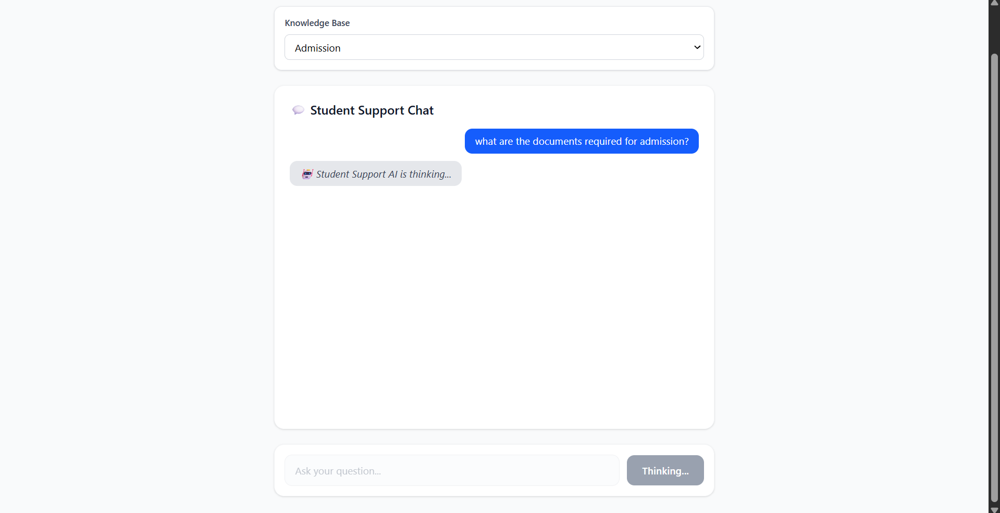
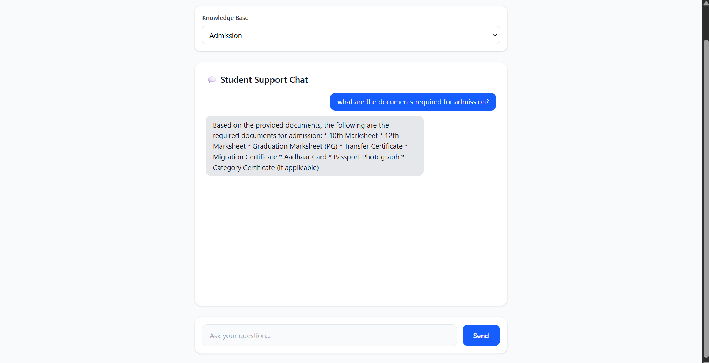
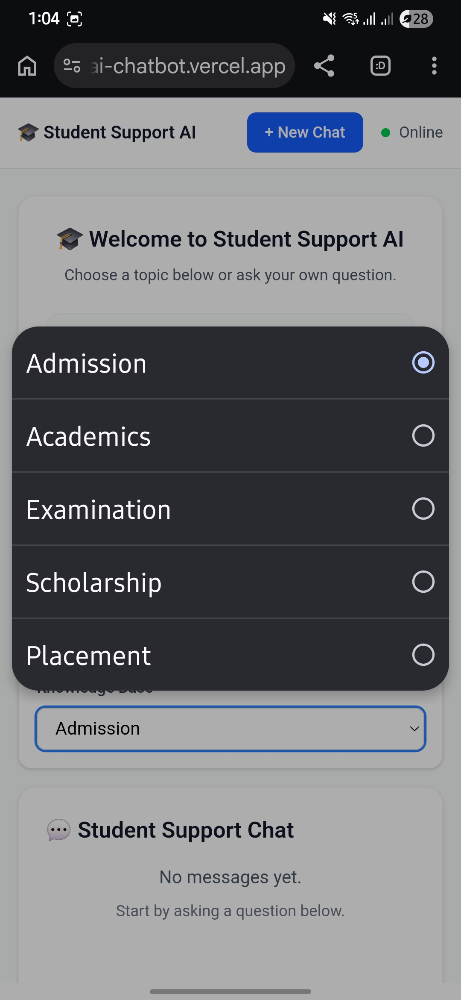

# 🎓 Student Support AI Chatbot (RAG Powered)

An AI-powered Student Support Chatbot built using **React**, **FastAPI**, **Google Gemini**, **FAISS Vector Database**, and **MongoDB Atlas**. The chatbot uses **Retrieval-Augmented Generation (RAG)** to answer student queries by retrieving relevant information from institutional PDF documents before generating AI responses.

🌐 **Live Demo:** https://student-support-ai-chatbot.vercel.app

⚙️ **Backend API:** https://student-support-ai-chatbot-backend.onrender.com

---

# 📖 Overview

Student Support AI Chatbot is a full-stack AI application designed to help students quickly access college-related information such as admissions, academics, examinations, placements, and scholarships.

Unlike traditional AI chatbots that rely solely on an LLM, this project implements a **Retrieval-Augmented Generation (RAG)** pipeline. User queries are first converted into embeddings, matched against a FAISS vector database built from PDF documents, and then the retrieved context is provided to Google Gemini to generate accurate, context-aware responses.

---

# ✨ Features

- 🤖 AI-powered conversational assistant
- 📚 Retrieval-Augmented Generation (RAG)
- 📄 PDF-based knowledge base
- 🧠 Semantic search using Gemini Embeddings
- ⚡ FAISS Vector Database for fast retrieval
- 🏷️ Category-wise knowledge bases
  - Admissions
  - Academics
  - Examinations
  - Placements
  - Scholarships
- 💬 Persistent chat history using MongoDB Atlas
- 🗑️ New Chat functionality
- 📱 Fully responsive interface
- ☁️ Cloud deployment with Vercel & Render

---

# 🏗️ System Architecture

```text
                    User Query
                        │
                        ▼
              React Frontend (Vite)
                        │
                        ▼
             FastAPI Backend (Python)
                        │
         ┌──────────────┴──────────────┐
         │                             │
         ▼                             ▼
Gemini Embeddings              MongoDB Atlas
         │                      (Chat History)
         ▼
   FAISS Vector Search
         │
         ▼
Relevant PDF Chunks Retrieved
         │
         ▼
 Google Gemini Flash Model
         │
         ▼
     AI Generated Response
         │
         ▼
        User
```

---

# 🛠️ Tech Stack

## Frontend

- React.js
- Vite
- Tailwind CSS
- JavaScript

## Backend

- FastAPI
- Python
- Google Gemini API
- Gemini Embeddings API
- FAISS
- PyMuPDF

## Database

- MongoDB Atlas

## AI / RAG

- Google Gemini Flash
- Gemini Embedding-001
- FAISS Vector Store
- PDF Chunking
- Semantic Retrieval

## Deployment

- Vercel (Frontend)
- Render (Backend)

---

# 📂 Project Structure

```text
Student-Support-AI-Chatbot
│
├── client/
│   ├── src/
│   ├── public/
│   └── package.json
│
├── server/
│   ├── data/                 # PDF Knowledge Base
│   ├── rag/
│   │    ├── pdf_loader.py
│   │    ├── chunker.py
│   │    ├── embeddings.py
│   │    ├── vector_store.py
│   │    ├── retriever.py
│   │    └── build_indexes.py
│   │
│   ├── vector_db/            # FAISS Indexes
│   ├── main.py
│   ├── requirements.txt
│   └── .env
│
└── README.md
```

---

# 🚀 Installation

## 1. Clone Repository

```bash
git clone https://github.com/manas-srivastava03/Student-Support-AI-Chatbot.git

cd Student-Support-AI-Chatbot
```

---

## 2. Backend Setup

```bash
cd server

python -m venv venv
```

### Activate Environment

Windows

```bash
venv\Scripts\activate
```

Linux/macOS

```bash
source venv/bin/activate
```

Install dependencies

```bash
pip install -r requirements.txt
```

Create a `.env`

```env
GEMINI_API_KEY=your_api_key
MONGODB_URI=your_mongodb_connection_string
```

Build the FAISS indexes

```bash
python rag/build_indexes.py
```

Run the backend

```bash
uvicorn main:app --reload
```

---

## 3. Frontend Setup

```bash
cd client

npm install

npm run dev
```

---

# 🌍 Deployment

| Service | Platform |
|----------|----------|
| Frontend | Vercel |
| Backend | Render |
| Database | MongoDB Atlas |
| Vector Store | FAISS |

---

# 📸 Screenshots

## Home Page

<p align="center">

</p>

---

## Chat Interface

<p align="center">

</p>

---

## Thinking State

<p align="center">

</p>

---

## AI Response

<p align="center">

</p>

---

## Mobile View

<p align="center">



</p>

---

# 🚀 How RAG Works

1. User asks a question.
2. The query is converted into a **Gemini Embedding**.
3. FAISS searches the most relevant chunks from the selected PDF knowledge base.
4. Retrieved context is sent to **Google Gemini Flash**.
5. Gemini generates an accurate, context-aware response.
6. Chat history is stored in MongoDB Atlas.

---

# 🔮 Future Enhancements

- 📑 Display source citations with page numbers
- 📄 Admin dashboard for uploading PDFs
- 🔐 User authentication
- 🎙️ Voice input support
- 🌐 Multi-language support
- 💬 Streaming AI responses
- 📊 Chat analytics dashboard

---

# 🤝 Contributing

Contributions are welcome!

1. Fork the repository

2. Create a new branch

```bash
git checkout -b feature-name
```

3. Commit changes

```bash
git commit -m "Add feature"
```

4. Push changes

```bash
git push origin feature-name
```

5. Open a Pull Request

---

# 📄 License

This project is licensed under the **MIT License**.

---

# 👨‍💻 Author

**Manas Srivastava**

GitHub: https://github.com/manas-srivastava03

LinkedIn: *(Add your LinkedIn profile here if you'd like.)*

---

# ⭐ Support

If you found this project useful, consider giving it a ⭐ on GitHub!