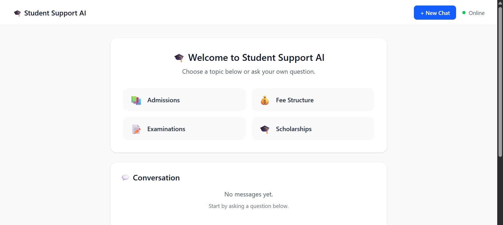
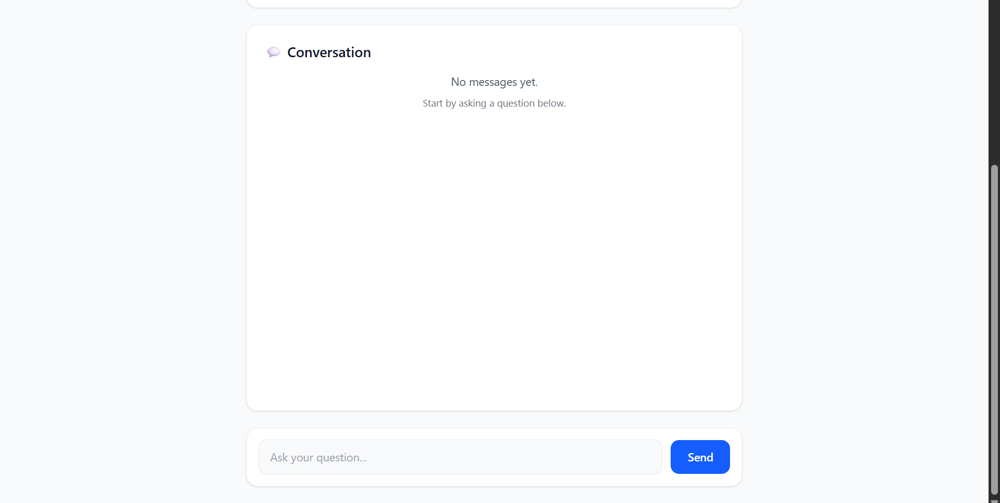
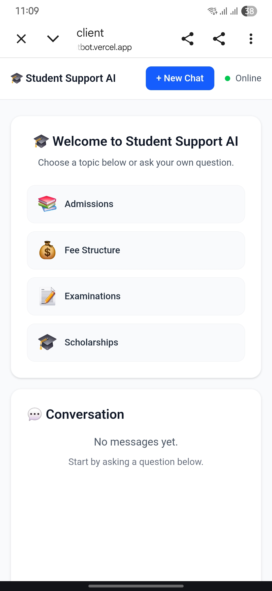
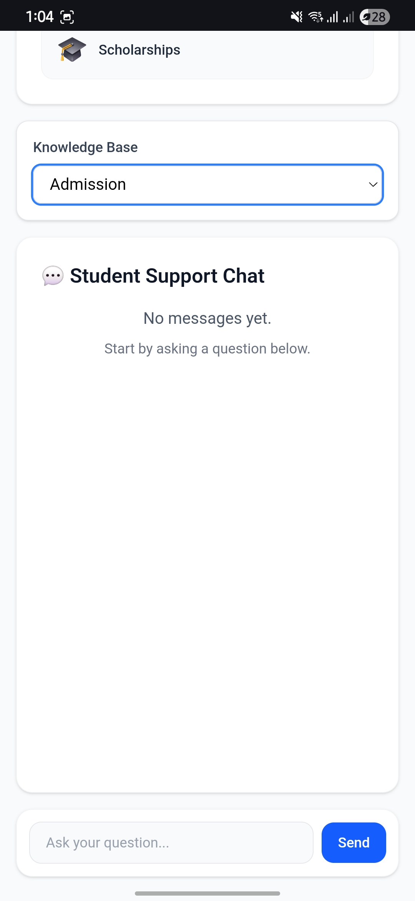

# 🎓 Student Support AI Chatbot

An AI-powered Student Support Chatbot built using **React**, **FastAPI**, **Google Gemini AI**, and **MongoDB Atlas**. The application provides students with instant answers to academic queries through an intuitive conversational interface.

🌐 **Live Demo:** https://student-support-ai-chatbot.vercel.app

⚙️ **Backend API:** https://student-support-ai-chatbot-backend.onrender.com

---

## 📖 Overview

Student Support AI Chatbot is a full-stack AI application designed to simplify access to student-related information. It offers a clean and responsive chat interface where users can ask questions or use predefined quick actions such as Admissions, Scholarships, Fee Structure, and Examinations.

The backend integrates with **Google Gemini AI** to generate intelligent responses, while **MongoDB Atlas** stores chat history for persistence across sessions.

---

## ✨ Features

- 🤖 AI-powered chatbot using Google Gemini
- 💬 Real-time conversational interface
- 📚 Quick Action Buttons
  - Admissions
  - Fee Structure
  - Examinations
  - Scholarships
- 📝 Persistent chat history using MongoDB Atlas
- 🗑️ New Chat functionality
- 📱 Responsive design
- ☁️ Cloud deployment using Vercel and Render

---

## 🛠️ Tech Stack

### Frontend
- React.js
- Vite
- Tailwind CSS
- JavaScript

### Backend
- FastAPI
- Python
- Google Gemini API
- PyMongo

### Database
- MongoDB Atlas

### Deployment
- Vercel (Frontend)
- Render (Backend)

---

## 📂 Project Structure

```text
Student-Support-AI-Chatbot
│
├── client
│   ├── src
│   ├── public
│   ├── package.json
│   └── vite.config.js
│
├── server
│   ├── main.py
│   ├── requirements.txt
│   ├── .env
│   └── ...
│
└── README.md
```

---

## 🚀 Installation

### 1. Clone the Repository

```bash
git clone https://github.com/manas-srivastava03/Student-Support-AI-Chatbot.git
```

```bash
cd Student-Support-AI-Chatbot
```

---

### 2. Backend Setup

```bash
cd server
```

Create a virtual environment

```bash
python -m venv venv
```

Activate it

**Windows**

```bash
venv\Scripts\activate
```

**Linux / macOS**

```bash
source venv/bin/activate
```

Install dependencies

```bash
pip install -r requirements.txt
```

Create a `.env` file

```env
GEMINI_API_KEY=your_google_gemini_api_key
MONGODB_URI=your_mongodb_atlas_connection_string
```

Run the backend

```bash
uvicorn main:app --reload
```

---

### 3. Frontend Setup

```bash
cd client
```

Install dependencies

```bash
npm install
```

Run the development server

```bash
npm run dev
```

---

## 🌍 Deployment

| Service | Platform |
|----------|----------|
| Frontend | Vercel |
| Backend | Render |
| Database | MongoDB Atlas |

---

## 📸 Screenshots

### Home Page



### Chat Interface



### Mobile Home View



### Mobile chat View



---

## 🔮 Future Enhancements

- 📄 Retrieval-Augmented Generation (RAG)
- 📚 PDF Knowledge Base Integration
- 🎤 Voice Input
- 🔐 User Authentication
- 🌙 Dark Mode
- 🌐 Multi-language Support
- 📊 Student Analytics Dashboard

---

## 🤝 Contributing

Contributions are welcome.

1. Fork the repository
2. Create your feature branch

```bash
git checkout -b feature-name
```

3. Commit your changes

```bash
git commit -m "Add new feature"
```

4. Push to the branch

```bash
git push origin feature-name
```

5. Open a Pull Request

---

## 📄 License

This project is licensed under the MIT License.

---

## 👨‍💻 Author

**Manas Srivastava**

GitHub: https://github.com/manas-srivastava03

---

## ⭐ If you found this project useful, consider giving it a star on GitHub!